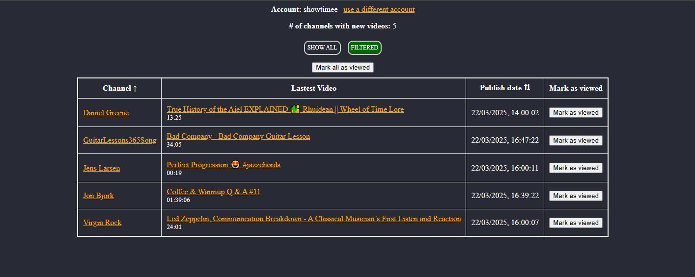

# CheckYoutube

A very simple test project written in Go that showcases the lastest video from each user's YouTube subscription that has new ("unread") content.



The code is not intended to be well polished or production-ready, and it's just a playground to demostrate how to:
- implement a simple oauth2 flow for user authorization
- interact with Google People and YouTube service APIs
- run a simple web server
- use Go HTML templates and pure Javascript to render the results

### Pre-requirements
- create a project using Google Cloud Console https://console.cloud.google.com/
- set up the oauth2 client for the application to generate the needed credendials. Refer to https://developers.google.com/identity/protocols/oauth2/web-server for a how-to guide.
- enable the People API and YouTube Data API v3	through the Google API Console.

### Usage
Set the following env variables:
- CLIENT_ID: The oauth2 client_id of the application
- CLIENT_SECRET: The oauth2 client_secret of the application
- SERVER_PORT: The server port, default to 8900
- OAUTH_LANDING_PAGE: The oauth2 landing page, e.g.: http://localhost:8900/landing
- SESSION_KEY: A random string used to init the session cookie store
- LOG_LEVEL: The log level, default to "INFO". Accepted values are case-insensitive: "DEBUG", "INFO", "WARN"/"WARNING", "ERROR" 

Running the code will start the web server. User should go to http://localhost:<SERVER_PORT>/login to login using Google, the server will then redirect the user to the main application page.

The repo contains a Dockerfile, so it's also possible to build a container and run it with Docker. 
For example, supposing to use a .env file to pass environmental variables and use 8900 as SERVER_PORT:
```
docker build -t check-youtube:0.0.1 .
docker run -p 8900:8900 --env-file .env --name=check-youtube -d check-youtube:0.0.1
```
